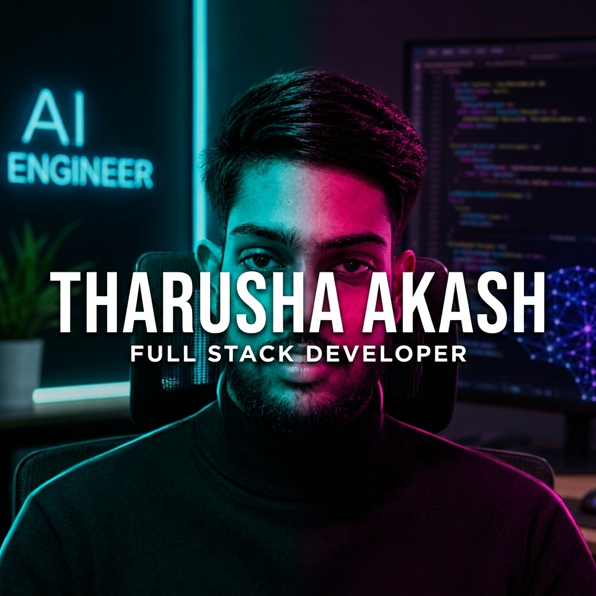

  
  

  

  

    
    
    
    
  

---

## 👨‍💻 About Me

I'm a passionate **Full Stack Developer** with expertise in building robust enterprise applications and modern web solutions. With a strong foundation in **Object-Oriented Programming** and experience across multiple tech stacks, I focus on writing clean code, scalable architecture, and turning complex problems into simple, maintainable software.

- 🔭 Currently building enterprise applications using the **MERN Stack** and **Spring Boot**.
- 🌱 Deepening my knowledge in **Microservices**, **Cloud Technologies**, and **System Architecture**.
- 🤝 Actively exploring advanced design patterns and looking for opportunities to collaborate on innovative projects.

---

## 🛠️ Tech Stack & Tools

  
<strong>Languages & Frameworks</strong>

  
  
    
  
  
<strong>Databases & Tools</strong>

  

---

## 🚀 Featured Projects

| 💼 **[Invoice & Quotation Management System](https://github.com/TharushaAkash/Invoice-Quotation-management-System)** | 📖 **[AutoFuelLanka - Vehicle Service System](https://github.com/TharushaAkash/systemmanager-new)** |
| :--- | :--- |
| Enterprise-grade system for generating and managing invoices and quotations.    **Tech:** JavaScript, Dart, C++, Firebase   **Features:** PDF generation, payment tracking, client database | Comprehensive management system designed for vehicle service and fuel stations.    **Tech:** Spring Boot, React, MySQL, Tailwind CSS   **Features:** Multi-Role Access, Service Booking, Inventory |

---

## 📊 GitHub Analytics

  
  

 

  

---

  
    
  Built with ❤️ by Tharusha Akash

